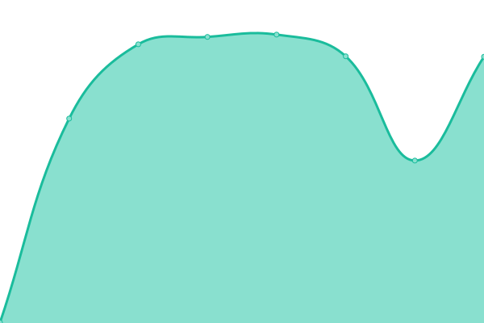
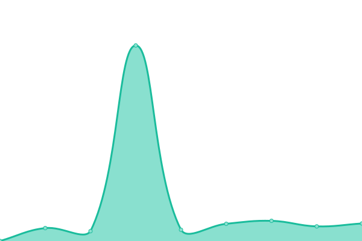

# [📈 Live Status](https://up.kjhbm.com): <!--live status--> **🟧 Partial outage**

This repository contains the open-source uptime monitor and status page for [x1891978](https://up.kjhbm.com), powered by [Upptime](https://github.com/upptime/upptime).

With [Upptime](https://upptime.js.org), you can get your own unlimited and free uptime monitor and status page, powered entirely by a GitHub repository. We use [Issues](https://github.com/x1891978/platinum-gateway-status/issues) as incident reports, [Actions](https://github.com/x1891978/platinum-gateway-status/actions) as uptime monitors, and [Pages](https://up.kjhbm.com) for the status page.

<!--start: status pages-->
<!-- This summary is generated by Upptime (https://github.com/upptime/upptime) -->
<!-- Do not edit this manually, your changes will be overwritten -->
<!-- prettier-ignore -->
| URL | Status | History | Response Time | Uptime |
| --- | ------ | ------- | ------------- | ------ |
|  [🟢 核心网关心跳 (Bridge)](https://api.kjhbm.com/healthz) | 🟩 Up | [bridge.yml](https://github.com/x1891978/platinum-gateway-status/commits/HEAD/history/bridge.yml) | 

 546ms
     
 | 

<a href="https://up.kjhbm.com/history/bridge">100.00%</a>
    

|  [🔵 计费与路由中枢 (New-API)](https://api.kjhbm.com/v1/models) | 🟩 Up | [new-api.yml](https://github.com/x1891978/platinum-gateway-status/commits/HEAD/history/new-api.yml) | 

 203ms
     
 | 

<a href="https://up.kjhbm.com/history/new-api">100.00%</a>
    

|  [⚡ 文本引擎 (Gemini 2.5 Flash)](https://api.kjhbm.com/v1/chat/completions) | 🟥 Down | [gemini-2-5-flash.yml](https://github.com/x1891978/platinum-gateway-status/commits/HEAD/history/gemini-2-5-flash.yml) | 

 3740ms
     
 | 

<a href="https://up.kjhbm.com/history/gemini-2-5-flash">100.00%</a>
    

<!--end: status pages-->

[**Visit our status website →**](https://up.kjhbm.com)

## 📄 License

- Powered by: [Upptime](https://github.com/upptime/upptime)
- Code: [MIT](./LICENSE) © [Anand Chowdhary](https://anandchowdhary.com), supported by [Pabio](https://pabio.com)
- Data in the `./history` directory: [Open Database License](https://opendatacommons.org/licenses/odbl/1-0/)
